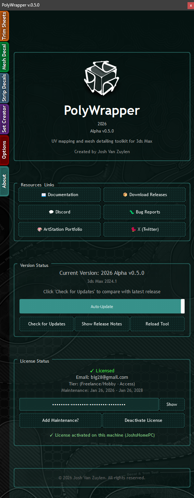

# Licensing

PolyWrapper uses a license key system for activation. Keys are purchased from Gumroad and activated inside the tool on the **About** tab.

## License Tiers

| Tier | For | Description |
|------|-----|-------------|
| **Freelance / Hobby - Access** | Individual users | Single-seat license for personal or freelance use |
| **Studio - Access** | Teams | License designed for studio and team environments |

Both tiers include the same features. The Studio tier is intended for multi-user environments.

[Purchase a license on Gumroad](https://joshvanzuylen.gumroad.com/l/mwktte)

## Activating Your License

1. Open PolyWrapper and go to the **About** tab.
2. Enter your license key in the License Status section.
3. Click to verify — the status updates to show **"Licensed"**.
4. Your license is now active on this machine.

Once activated, the License Status panel shows:
- Your email address
- License tier (e.g. Freelance/Hobby - Access)
- Maintenance window dates (e.g. Jan 26, 2026 - Jan 26, 2028)
- Which machine the license is activated on
- A **Show/Hide** toggle to reveal or hide your license key

Your license is bound to **one machine at a time**. If you need to move it to a different machine, deactivate first (see below).

## Switching Between Max Versions

If you use multiple 3ds Max versions on the **same PC** (e.g., Max 2024 and Max 2026), your license transfers automatically. There's no need to deactivate and reactivate when switching between Max versions on the same machine.

## Deactivating Your License

To move your license to a different computer:

1. Go to the **About** tab.
2. Click **Deactivate License**.
3. Your activation is released and the key can be used on another machine.

## Maintenance Window

Each license includes a **2-year maintenance window** from the date of purchase. During this window, you receive all updates and new versions.

- **During maintenance:** Install any version released within your window.
- **After expiry:** You keep your current version but cannot update to newer releases.

### Extending Maintenance

Purchase a **Maintenance key** to extend your update window. Click **Add Maintenance?** on the About tab and enter your maintenance key.

If your maintenance is expiring soon (within 7 days), PolyWrapper will show a notification with the option to renew.

## Troubleshooting

**Activation fails on a studio network:**
Some firewalls block the license verification request. PolyWrapper has a fallback network method for these situations — if the first attempt fails, it automatically retries with an alternative approach.

**License shows as activated on another machine:**
Deactivate the license on the other machine first, or if you no longer have access to it, the activation will auto-transfer if it detects you're on the same PC (same hostname).

---

[Back to Home](../README.md) | [Updating](updating.md)
